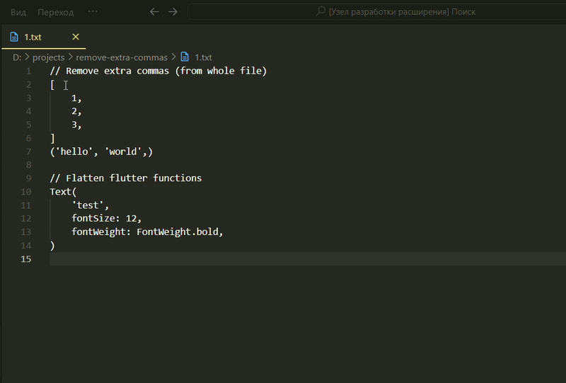

# 🧹 Remove Extra Commas & Flatten Functions
<p align="center">
  
  
  
  
</p>
A Visual Studio Code extension that provides two code-cleanup utilities:

- ✅ **Remove unnecessary commas before closing brackets** (like `, ]` → `]`)
- ✅ **Flatten multi-line function calls** into single-line (like `Text(...)`)

---



---
## 🚧 Status: Work in Progress

This extension is still under development and not yet released on the Visual Studio Code Marketplace.  
You're welcome to test it locally and contribute feedback.

---

## ✨ Features

### 🔸 Remove Extra Commas

Removes commas that appear just before:

- `)` — closing parentheses
- `]` — closing square brackets
- `}` — closing curly braces

**Example:**

```dart
List items = [1, 2, 3, ];
Text(
  'hello',
  fontSize: 16,
);
```

→ becomes:
```dart
List items = [1, 2, 3];
Text(
  'hello',
  fontSize: 16
);
```

###🔸 Flatten Function Call

Allows you to select a function call (like `Text(...)`) and convert it into a single-line format.

Example:
```dart
Text(
  'hello',
  fontSize: 16,
  fontWeight: FontWeight.bold,
)
```

→ becomes:
```
Text('hello', fontSize: 16, fontWeight: FontWeight.bold)
```
🧠 How It Works

 - Works on unsaved files
 - Internally uses Python scripts to parse and transform code
 - Entirely client-side, no internet required

## 🛠️ Commands
| Command                     | Description                                                     |
| --------------------------- | --------------------------------------------------------------- |
| `Remove Extra Commas`       | Removes trailing commas before brackets                         |
| `Flatten Selected Function` | Converts a selected multi-line function call into a single line |


You can access these via Ctrl+Shift+P command palette.
## 📦 Installation

For local installation:
```
npm install -g vsce
vsce package
code --install-extension your-extension-name.vsix
```
## 💬 Feedback & Issues

Feel free to open an issue if you find bugs or have ideas for improvement.
## 🧪 Requirements
 - Python 3.x installed and available as python in system PATH

##📄 License

This project is licensed under [MIT](./LICENSE) license
